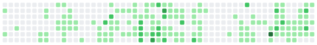

<!--
  GitHub Profile README for @gitOfKuKue
  Deploy: copy contents into https://github.com/gitOfKuKue/gitOfKuKue/README.md
  Portfolio reference: https://kukue.vercel.app/
-->

<div align="center">

  

  <br/>

  

  <p>
    <a href="https://kukue.vercel.app/"></a>
    <a href="mailto:thuhtetnaing.14.11@gmail.com"></a>
    <a href="https://github.com/gitOfKuKue"></a>
  </p>

  <p><em>— I'm Ku Kue, a fullstack developer based in Ho Chi Minh City, Vietnam.<br/>Passionate about building modern, responsive, and user-friendly web applications.</em></p>

</div>

---

## About Me

I enjoy solving complex problems through technology and turning ideas into practical digital solutions. Every project has taught me something new — from writing clean, maintainable code to designing intuitive user experiences and building scalable systems.

My goal is to keep learning, embrace new challenges, and create software that has a real impact on people.

<div align="center">

| 🚀 Projects | ⏳ Experience | 💎 Mindset |
|:---:|:---:|:---:|
| **+9** completed | **4+** years | **120%** care on every build |

</div>

> Extra care on every build — clarity, polish, and products that feel finished.

---

## What I Build

<div align="center">

| 🌐 Web applications | 📱 Mobile applications | 🔌 APIs & backends | ✨ User interfaces |
|:---|:---|:---|:---|
| Fast, accessible product experiences with **React** & **Next.js** — marketing sites to full dashboards | Polished mobile apps with **Expo** / **React Native** that feel native and calm | Reliable APIs, auth flows, and data layers with **NestJS**, **Node**, and **PostgreSQL** | Intuitive UI systems — requirements turned into clear, shippable experiences |

</div>

---

## Skill Radar

<div align="center">

  

</div>

---

## Skills Breakdown

<div align="center">

  

</div>

### Tech I ship with

<div align="center">

  

</div>

<br/>

<details>
<summary><b>Hard skills</b></summary>
<br/>

| Area | Stack |
|:---|:---|
| **Frontend** | TypeScript, React, Next.js, Tailwind CSS, Framer Motion |
| **Mobile** | Expo, React Native, Reanimated |
| **Backend** | NestJS, Node.js, Express, REST APIs, WebSockets |
| **Data** | PostgreSQL, TypeORM, Redis, Supabase |
| **Platform** | Docker, Cloudflare, Vercel, GitHub Actions |
| **Design** | Figma, UI systems, accessibility-minded UX |

</details>

<details>
<summary><b>Soft skills</b></summary>
<br/>

```text
Communication     ████████████████████░░  90%
Problem Solving   ███████████████████░    94%
Client Partnership████████████████████    95%
Adaptability      ███████████████████░    92%
Ownership & Polish████████████████████    96%
```

</details>

---

## Animated Progress

<div align="center">

| Skill | Level |
|:---|:---|
| React / Next.js |  |
| TypeScript |  |
| Expo / React Native |  |
| NestJS / Node |  |
| PostgreSQL / Supabase |  |
| UI / UX |  |

</div>

---

## GitHub Pulse

<div align="center">

  
  

</div>

<div align="center">

  

</div>

<div align="center">

  

</div>

---

## Contribution Snake

<div align="center">

  <!-- Commit these SVGs next to README.md in gitOfKuKue/gitOfKuKue -->
  <picture>
    <source media="(prefers-color-scheme: dark)" srcset="./github-contribution-grid-snake-dark.svg" />
    <source media="(prefers-color-scheme: light)" srcset="./github-contribution-grid-snake.svg" />
    
  </picture>

</div>

---

## Featured Work

<div align="center">

| Project | Focus |
|:---|:---|
| **[ByteWallet](https://github.com/gitOfKuKue/ByteWallet-v2)** | Fullstack finance wallet — Expo / React Native + NestJS + PostgreSQL |
| **[Marina Travel](https://github.com/gitOfKuKue/marina-travel)** | Travel product UI in TypeScript |
| **[Portfolio](https://kukue.vercel.app/)** | Personal site — Next.js on Vercel |

</div>

<p align="center">
  <a href="https://github.com/gitOfKuKue/ByteWallet-v2">
    
  </a>
  <a href="https://github.com/gitOfKuKue/marina-travel">
    
  </a>
</p>

---

## Let's Build Something

<div align="center">

  

  <br/>

  <a href="https://kukue.vercel.app/">
    
  </a>
  &nbsp;
  <a href="mailto:thuhtetnaing.14.11@gmail.com">
    
  </a>

</div>

---

<div align="center">

  

  <p>
    
  </p>

  <sub>Crafted with care · Inspired by <a href="https://kukue.vercel.app/">kukue.vercel.app</a></sub>

</div>
